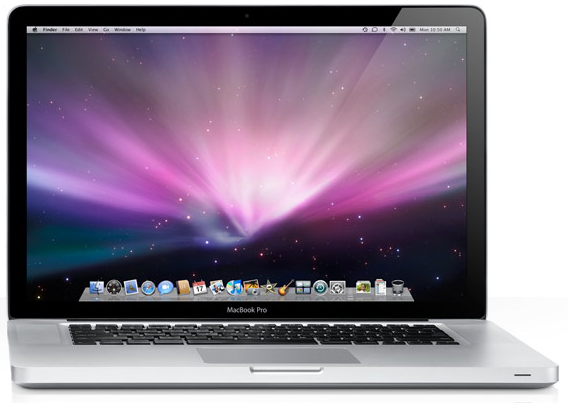

I’m sure it’s old news by new, but Apple announced updates for their Macbook lines today. They look pretty snazzy, sporting thinner aluminum cases and black plastic near the monitor. I’m not sure I’m sold on the decision to make the monitor glossy (as this makes it more difficult editing photos, IMO), but all in all it looks like a step in the right direction.

As I’ve indicated previously, I’m focusing on paying off my student loans for the next little while, which basically means no major purchases. For the time being I’m going to try and stick with my Macbook Pro, even though the backslash key stopped working a few weeks ago.

What does everyone else think of the announcements?