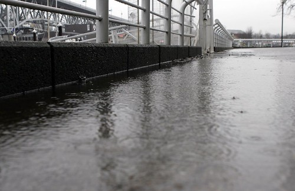

This is the first weekend in ages where I really don’t have a pile of plans. Given that it’s absolutely horrible outside, I think I’m going to get some groceries, make some coffee, and watch movies on the couch most of the weekend.

If I do watch a movie, I’ll probably pop in the extended edition of the Fellowship Of The Ring, since I haven’t watched it in ages. What better way to spend your weekend than going on a 12 hour journey into the heart of Middle Earth?

Right now I’m working from home, waiting patiently for the guys at Pender Auto Body to come grab me so I can pick up my car. They pulled out a dent on the door (from a hit and run), and repainted both doors on the driver’s side. They also touched up a slight chip on the back quarter-panel, so hopefully it’ll be as good as new when I grab it.

I have a pile of laundry and housework to catch up on also this weekend, so I’m going to take a stab at making my place presentable again as well. Also, in terms of my loans that I mentioned a few weeks ago, I’m hoping to pay off my car loan sometime in the next four weeks. That’ll put $400/month back into my pocket, and allow me to start dropping student loans rather quickly. I’ll make a post when that time comes, hopefully sometime around November 15th.