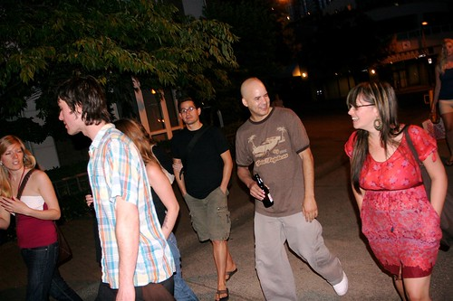

Unfortunately, there are very few people in this world nowadays who aren’t full of shit. I have been around many blocks, and met many people, and I always end up (thankfully) back home with the same people I left with. That said, you do meet the odd person once and a while who is as good as his or her word.

Today (depending on when you read this) is [Tony Pierce’s](http://busblog.com) birthday. I originally met Tony down at Matt’s Las Vegas birthday party. I didn’t get to spend a lot of time talking to him down there, but slowly, since then, have gotten to know Tony, and been privileged enough to drink the odd beer with him. I spent last new year’s with him, Phil and [Raymi](http://raymitheminx.com), and was thankful he was around to chill with me during the days. When I was down in Los Angeles in June, Tony made sure to clear his schedule so that him and I could drink beer and litter in a North Hollywood parking lot close to a strip club. Much appreciated, bud.

Tony has a kick ass job at the LA times, and deserves every bit of success he has obtained in his life. At every turn, he has been both humble and kind, and I’m proud to call him my friend.

And with that, I wish my good friend down south a very happy birthday. All the best Tony.