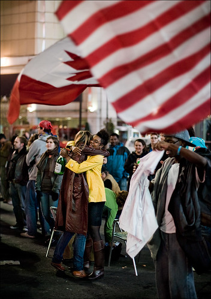

It’s been a few days now since president-elect Barack Obama won the election, and I thought I would share a few thoughts. The day of the election I saw an interview with a prominent African American on CNN who said that should Obama win, you would literally be able to divide the history of the United States into two time periods: the period before Obama, and the period after. He said from that moment on, you would no longer be able to say that certain things were not possible in the US if you were a person of colour. For the first time, he would be able to tell his son that he could become whatever he aspired to be in his lifetime, and could point to Obama’s victory as an example of that.

The historical significance of having an African American become president, especially given the history of the United States with regards to slavery, cannot be understated. And more importantly, the fact the Barack Obama won at all, given that he was the clear underdog in the beginning, speaks volumes to the number of people who genuinely want change in the United States.

Let it also not be forgotten that the victory the other night was not celebrated by the United States alone. In Vancouver, I saw more people watching the TVs in the Yaletown Brew Pub than I’ve seen for any playoff hockey game in Vancouver, and far more tears (although the Canucks losing the Stanley Cup that year was a close second). In Kenya, they celebrated by declaring a national holiday. People were cheering in the streets of Tanzania. The photo above was taken in Toronto. It is clear that the election was not only a great importance in the United States, but also of importance on the world stage.

It will be a few months before Obama takes control of the White House, but I’m extremely optimistic about his ability to inspire change, not just in the United States, but also throughout the world.