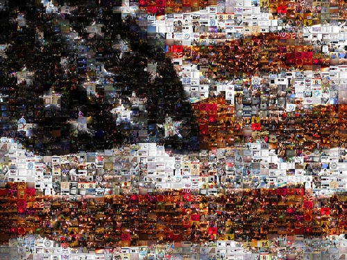

if (is_single()) { ?

} ?I did something similar in Feburary of this year for Northern Voice, and I thought it would be a good idea to try again. Given that Barack Obama was one of the first presidential candidates to embrace social media, I thought I’d do a celebratory mosaic using a public photos posted to Flickr.

The image is constructed using Flickr photos from everyday, normal people, the same people who helped Obama and his grass-roots campaign to secure the presidency. The search tags used on Flickr were “obama election victory” and “obama celebration”. The result is a mosiac using 1600 images.

Enjoy. If you’d like to see a higher resolution version, [head on over here](http://www.flickr.com/photos/duanestorey/3009286834/sizes/o/).