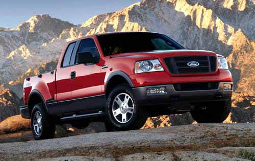

if (is_single()) { ?

} ?How do you feel about that? I [read this article with the CEO of Ford today](http://www.cnn.com/2008/US/11/18/mulally.automaker.bailout/index.html), where the interviewer basically pummeled him. When asked about Ford’s strategy with regards to electric cars, the CEO had this to say:

> We are working on that \[fully electric cars\], but let me just share with you the Ford plan about that. Our No. 1 priority is to improve the internal combustion engine, and that’s why the turbocharging, the direct fuel injection, we get a 20 percent improvement in fuel mileage and a 15 percent reduction in CO2, but we get that across all of the engines, across all the vehicles. Then we move to more electrification with the hybrids as you mentioned, and we are very excited that the next step after that will be full electrification. Now we’re tied into the grids, and we really have moved to an energy independence solution.

First, the number one vehicle at Ford is the F-150. It gets around 15 MPG. My car (a Mazda, partially built in Japapn) gets closer to 30 MPG. Most new hybrids coming out (and a few diesel cars) get closer to 60 MPG \*today\*, and their next models will be increasing that even more. So frankly, while a 20% fuel reduction is a good start (which would bring the F-150 milage to 18 MPG), it falls pretty short of the fuel efficiencies of most modern cars. If anyone has any stats on Ford’s cars with regards to fuel efficiency, please post them as I only have the trucks.

  
Photo from [here](http://inplacenews.wordpress.com/2008/05/14/ford-motors-takes-a-huge-hit/)

The US in in a dangerous predicament. One person said it best with regards to Wall Street — they are trying to privatize profits and socialize losses, which is exactly what the big three automakers are trying to do. I hope whatever bail-out the US government comes up with is a big ball of yarn with regards to having strings attached. Personally, I’d like to see some of the bail-out money be in exchange for stock, so that should those companies suddenly be successful again, the American public will benefit from it. Right now the bail-out packages only have down-sides from the tax-payer’s perspective — they should have a lucrative up-side as well.

In the normal business world, when you run out of money, you can either take out a loan, or dilute your stock and raise more capital. In both cases, you don’t get the money without any strings attached. In the first case, you have to pay interest back (which is the upside for the lender), and in the second case, you’ve diluted your shares, and given some controlling interest to the stock purchaser. In that case, the upside for the purchaser is the potential for the stocks to rise to a point above their purchasing price, at which point they’ve made a profit. So with regards to the bailout, I really think the tax payer’s deserve a scenario where an upside is possible.

The auto companies really need to innovate again and compete in the global market, and also find a way to make themselves relevant again, especially if they are financing their future using the tax dollars from ordinary citizens.