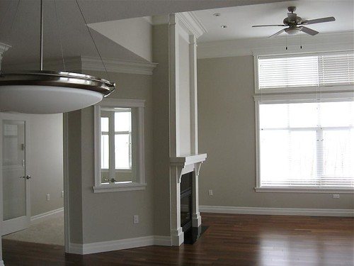
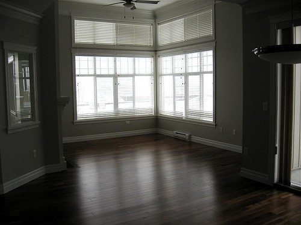
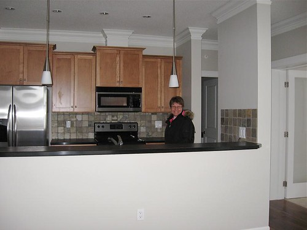
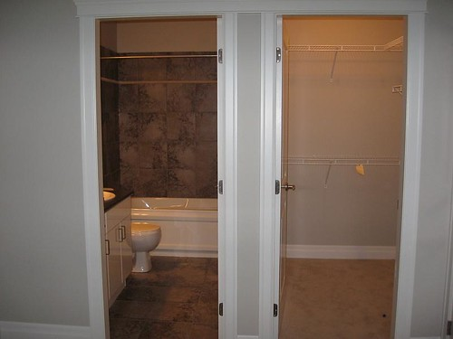

The landlord let me have the key to my new apartment for a few hours this morning. Traveling from Chilliwack to Sardis was a bit tense as there’s so much snow. But once we got there, I had a little bit of time to inspect my new place. Here are a few shots.

First, a shot of my office (on the left), and the living room (right), completed with gas fireplace and 12 foot ceilings.

A shot of the living room from the dining room.

A shot of my step-mom in the kitchen:

A shot of the ensuite bathroom and the walk-in closet.

I’m definitely looking forward to moving in. Only a few more weeks.