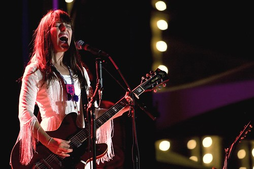

Last year I attended the 2008 Canadian Juno awards in Calgary, AB, as a media representative for Urban Vancouver. The media accredidation is open for this year’s awards show, which are in Vancouver. I would love to attend this year as a photographer again, but am hoping to be able to go as a social media representative for another company where the coverage can potentially reach more people.

I received a great deal of coverage both during and after the event, and was essentially one of the only social media people in the room who was using grass root’s technology to showcase the behind the scenes experience. I used Flickr, Blip.TV, my own personal blog, and the Urban Vancouver site to allow people to participate along. While mainstream media was packing up their gear and heading back to the station to process their video, I was drinking beer because I had already gotten my photos and my article online. Some of the photos from that event are [here](http://flickr.com/photos/duanestorey/sets/72157604321984640/).

Since then, I have also covered many events, including the BC Festival 150 concert in Victoria. While not there as an official photographer, I was approached a few weeks later by the marketing agency behind the festival and told that my photographs were the best of the event, and that they would like to purchase them for publication.

So if any company or media agency is looking to send someone to the Juno awards in Vancouver, I’d be happy to go as a representative. Having attended the event before, I know full well what’s involved, and what I would do differently (and also what I would do the same). Given that they are also here in Vancouver, I also understand the nightlife, and where most of the after parties will most likely be.