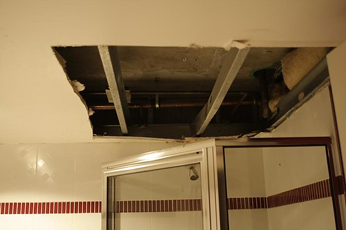

In just four days, I get to swing out to Chilliwack and grab the keys for my new place. First thing I’m looking forward to is turning the heat on in the new apartment, as it was pretty cold there when I swung by for a visit in December. My furniture is supposed to be delivered on January 20th, but I think I’m going to put the call in to deliver it on the morning on the 15th or something. I have to leave work a bit early on the 14th to make it to Chilliwack in time to do the walk-through on my place, but I’d like to do that part myself and meet my landlord as well.

I’m planning on leaving my car in Chilliwack from that point on, so I’ll probably take a bus or catch a ride with my dad to the skytrain on the Thursday morning so I can head back into work. At that point, I’ll have just a day and a bit left of my old job. Friday I’ll probably grab a few beers with some friends, as it’s basically my last night in town here. Saturday I’m planning on packing and cleaning all day, and Sunday is the day of the move. Somewhere in my current place is my old cable modem that I need to find as they need that to turn the internet on on the 15th.

I am paying a little extra for a one way move so I can leave the moving truck back in Chilliwack. So once I get all my stuff loaded up, I’m basically a local again, which will be interesting. I’ll probably just tinker around for a few days at that point and work towards getting my place cozy and everything unpacked. As I have a new dining room table set and a full bedroom suite coming, I’ll finally have a real, adult place going for myself, which I’m kind of looking forward to. I want to replace the lamps I have in the living room, and come up with some lighting that has a bit of mood to it. I’m a big fan of warm, cozy places, so I’m going to try and get my living room set up with that in mind.

And for those of you following [my Twitter stream](http://twitter.com/duanestorey), you’ll know that there was a bit of a plumbing disaster here yesterday. I woke up with the dripping sound of water coming down from the shower above mine. Apparently the upstair’s tenant’s shower drain wasn’t properly sealed and water has coming down. The end result is that the ceiling is pretty much toast in my current bathroom, and my closet (in my bedroom) is a bit wet as well. I currently have a big dehumidifier in the bathroom that needs to stay on 24/7 for about a week. Hopefully I’ll be long gone before they start putting it all back together here.