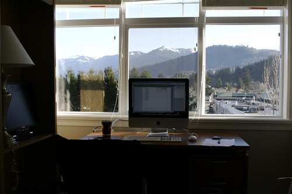

Well, after nearly 13 years, I’m finally back home. It’s been quite the rollercoaster ride really, looking back over that period of time. I left Chilliwack back when I was 18 years old to attend university. When I graduated, I moved myself across the country and spent a few years in Ottawa working in the high-tech sector out there. Then I moved back home and did a bit more school, and finally ended up at CounterPath, where I have spent the last five years working away.

The move was pretty uneventful thankfully. My dad came out in the morning to help, which was totally appreciated as it turns out we didn’t have enough room for everything. After the truck was loaded on the Vancouver side, I was pretty beat. Thankfully I had a nice drive out into the Fraser Valley which sort of reinvigorated me.

By around 5pm I had everything unloaded in my new place out here, and then dropped the U-Haul off. I realized I had left my laptop in the city though, which sort of stressed me out, especially since I knew people would be working on my apartment all week out there to fix the water damage. So I hopped in the car with my brother in law and headed back real quick to get it, along with a few plants I had left out there.

So anyways, I’m now setup in my new apartment. The guys from the Brick just came by and exchanged my table for a new one, so hopefully I’ll be able to get that set up properly sometime this event. I’m using a camping chair in my office right now, which is basically as uncomfortable as it gets, so I’ll probably swing by Staples tonight and try to pick up a new one.

Speaking of my office, here’s a quick shot from this morning:

I’ll post more photos as I slowly get everything together here.