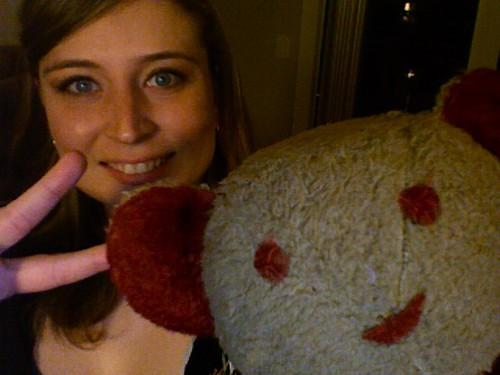

That’s Rebecca and Teddy at my place in Chilliwack. Teddy was given to me by my grandma when I was less than a year old. I’ve had him ever since, and have been keeping him around for when my first kid is born. As a kid, Teddy and I went through lots of hard times, and it’s pretty encouraging to know he’s still around to see me through the bad times, even as an adult.

When my grandma went into surgery years ago, I thought I’d return the favour, and left Teddy under her arm in the recovery room at Chilliwack General. Since then, she’s made sure to see how he was doing from time to time, and I conveniently have left him out around my apartment so she can say hey from time to time.