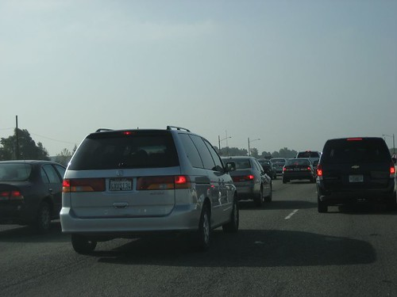

Having driven over the Port Mann bridge probably close to a thousand times in my life, I’m pretty much an expert on how traffic works in that area. Years ago, in an effort to relieve some congestion for westbound traffic heading into Vancouver, the city created a dedicate HOV (high occupancy vehicle) lane that goes pretty much from the Port Mann bridge all the way to the Hastings exit downtown.

Unfortunately though, one of the characteristics of that lane is that it’s rarely used to capacity. There’s nothing more frustrating than sitting in grid-locked traffic and seeing a completely empty lane to your far left. I can’t even imagine how much it cost to construct that lane, and to have it sitting idle sure isn’t helping relieve congestion, or the frustration of daily drivers.

If we go back to first principles and employ Occam’s Razor, we have to ask the question, “which is more likely, that people are simply too lazy to organize carpools into the city each day and that they’re content dealing with grid lock, or that carpooling simply isn’t an option for the majority of people.”

I obviously believe it’s the latter, as there are very few jobs I’ve had in my lifetime where carpooling would have been a realistic option. The reality is that peoples’ schedules simply don’t align very often. Given how little free time I had in the city, the last thing I’d want to do would be to sit around work for an extra hour while waiting for my friend to finish up work so that we could head home together.

So I’d like to propose an alternative option. Leave the HOV lanes intact, and allow all carpools to use that lane for that purpose. In addition, charge a monthly free for an HOV pass that allows you to use that lane even if you’re a single driver. Use 100% of that money to fund public transit for future projects, and help improve transit in the region. With that model, you can have that lane used to a higher capacity, and also help fund future projects that may relieve congestion. You could even use some of the money to purchase carbon credits to offset the fact that a single occupancy driver is in that lane.

Given that so many of the options for relieving traffic in Vancouver involved expanding roadways or twinning bridges, I think a plan that better utilizes existing transportation infrastructure is a pretty good option.