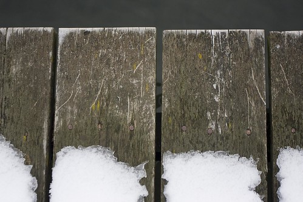

I gotta say — I’m fairly amazed that it’s still snowing on the west coast. I woke up to a white coating on the local mountains and houses here.

I actually spent a few years living in Ottawa, and one of the reasons I came back was because the weather was so much warmer out here. But this is without a doubt one of the craziest winters I can remember. Cultus Lake provincial park is only a few weeks away from opening, so it’s pretty incredible that we’re still plagued by this cold snap. I sure hope we’re privileged enough to have an extra warm summer as payback for this dismal winter.

Anyone have any cool plans for the summer? Vacation, camping? Let us know!