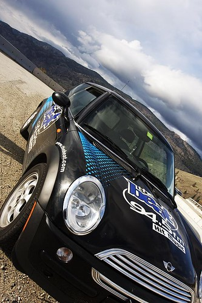
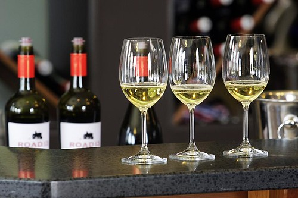
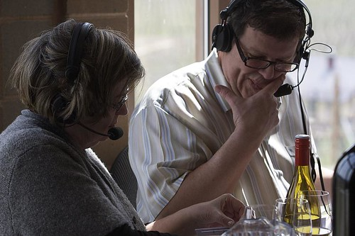
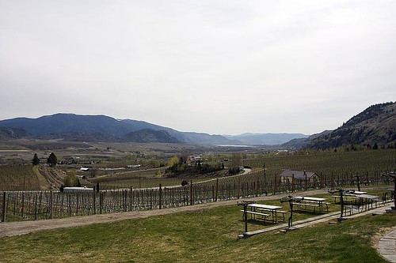

Last week [John Bollwitt](http://www.johnbollwitt.com) sent me a Twitter message and asked if I wanted to come out to the Okanagan this weekend. John was asked to setup for a live radio broadcast out at a winery, and unfortunately Rebecca couldn’t go with him. So, being the amazingly awesome friend that I am, I packed up my camera and hopped into John’s company’s mini-cooper.

It was a leisurely four hour drive from Chilliwack out to Osoyoos, and John and I just listened to music and got caught up. We basically just sat around and watched TV the first night, as we were both a bit beat from the drive.

The second day I basically did a full day of work while John went up to the winery to scope out the territory and get prepped for the Saturday broadcast. Afterwards we went downtown and got a bunch of beer and enough groceries to make some pretty awesome steaks on the BBQ. Despite only having about three beers that night, I woke up on Saturday with am amazingly crappy headache, one that basically stayed with me until supper time. Thankfully John brought along some Ibuprofen, which helped fend out the migraine.

The owners of the [Road 13](http://www.road13vineyards.com/) winery were great hosts for the live broadcast, and even went out of their way to make sure we had wine if we wanted it, or a nice, tasty sandwich at lunch time. That sandwich was actually pretty much the best sandwich I’ve had in years, something I’m sure John agrees with me on.

The hosts for the Food &amp; Wine show broadcast were Tony Gismondi and Kasey Wilson, who had arrived from Vancouver the night before. I’ve actually never seen a live broadcast before, so it was pretty cool watching the orchestration between John, the technical lead back in Vancouver, and the two hosts. After the show was over Kasey packed up some of the nice wines they had been tasting on the air and gave them to John and I to take back with us. That was obviously a nice gesture, and one that John and I both appreciated, especially later that night when we were chilling back in the condo.

All in all, it was a great trip. Whenever I travel I always get the urge to travel even more. It reminds me of a line from Ulysses — “All experience is an arch wherethrough gleams that untravelled world whose margin fades for ever and for ever when I move.” One of these days I’m going to wake up in the morning and get on a plane to Hawaii. I’m pretty sure I have enough airmiles on my Visa card to pull off the flight portion, and working from the beach in Hawaii seems mighty appealing.