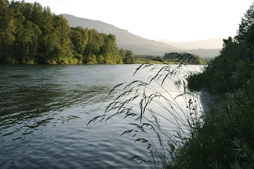
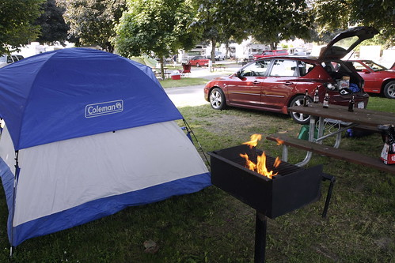
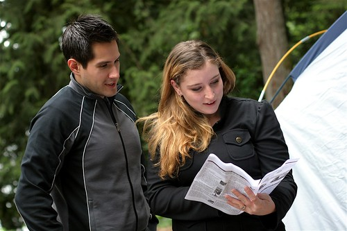

As most people already know, I am a big fan of camping. I’m not really sure why to be honest, but there’s something about being in the wilderness with nothing but a bit of nylon between you and the outdoors that I’ve always found appealing. Maybe it started years ago when my dad and I used to crash out in his camper when I was a kid. Maybe it was all those trips I did with Brennen and Jeff in the old days. Needless to say, it’s one of the things about summer I always look forward to.

Last summer was unique — it was the only summer in ages where I looked back and actually felt like I did enough camping. I did a road trip by myself through the North Cascade mountains in Washington, hit Cultus Lake with the usual suspects, and even did a weekend trip up to Birkinhead Lake with my friend Rob. In other years though, I spent most of the summer wishing I could find the time to go camping, but never actually found the time to pull it off that often.

One of the reasons I moved back home was to have the opportunity to go camping whenever I wanted. Given that I’m only about a five minute drive from Cultus Lake, I’m hoping that I’ll be able to scoot up there from time to time this summer and snag some prime camping real-estate for me and some friends.

In addition, I’m hoping to do a road trip sometime this summer, most likely in July or August. Most of the KOAs in the US have Wi-Fi these days, so as long as I’m working for Canadian clients, there’s no reason I can’t simply hop in the car and spend a couple of weeks leisurely bouncing between campgrounds down south. My friend Jason also introduced me to a little CDMA device down south that basically lets you be online whenever you want, so maybe I can get my hands on one of those as well.

Part of the fun for me is just playing it all by ear. Years ago I woke up one morning and had the urge to do a road trip. I wound up in San Francisco a few days later, having driven down the coast for something to do. So I imagine one day this summer it may be the same. I’ll just wake up one morning, load my camping gear into the car, and start heading south.

Provincial parks typically open for the May long weekend, so I’m trying to keep my schedule open with the expectation that I’ll hit a campground that weekend. After that, I’ll probably do the odd weekend camping trip, maybe even hitting Goldstream again on Vancouver Island. And hopefully at some point this summer, will be blogging from a picnic table somewhere down south, maybe in the Rockies somewhere.