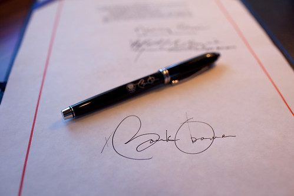
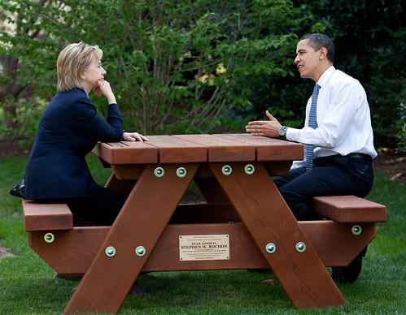
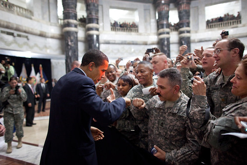
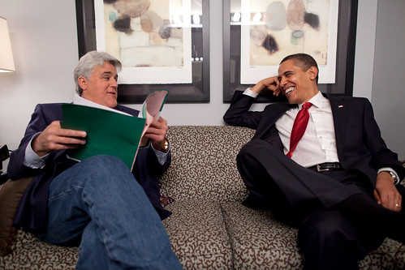
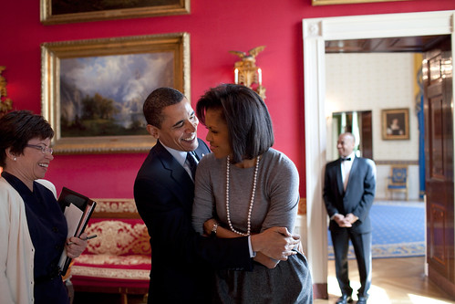
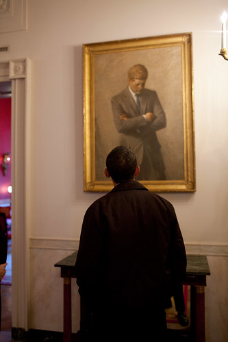

I accidentally stumbled across [the official Whitehouse Flickr account](http://www.flickr.com/photos/whitehouse/) tonight, and was pretty enthralled by some of the photos in the account. First thing that’s cool is that the Whitehouse even has a Flickr account. Second thing to take note of is that the photos are licensed with a [creative commons attribution license](http://creativecommons.org/licenses/by/2.0/deed.en), so basically you’re free to use them in both commercial and non-commercial settings as long as you do proper attribution.

I’ve always liked looking at candid photos from other presidencies. For whatever reason, I took a fascination with those from Kennedy’s administration, probably because there were a lot of family moments with him, and moments between him and his brother.

Here are a few shots from the Whitehouse stream that I think are particularly awesome:

And my personal favourite, a shot of Obama looking at a portrait of Kennedy:

All photos from [The Official Whitehouse Photostream](http://www.flickr.com/photos/whitehouse/).