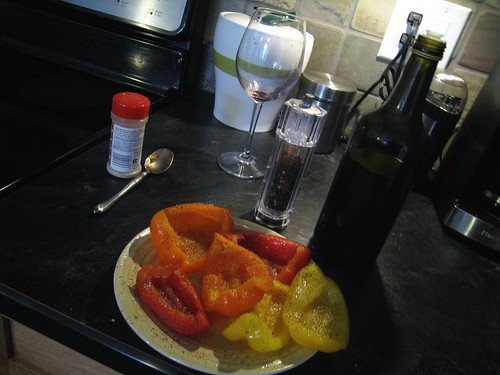

When I moved back to Chilliwack, one of the first things that changed was my diet. I typically worked long hours in Vancouver, and that naturally led to me eating a lot of restaurant food. I’d normally want to sleep in as long as possible in the mornings, so I usually skipped breakfast in exchange for a few more minutes of zzzz’s. Lunch was normally something I’d eat down in the Food Court in the Bentall Center. There weren’t a lot of food options, but I’d typically switch between Subway or sushi. Dinners were a bit more varied — a lot of times I went out with friends after work, and other times I’d just grab a wrap or something while walking home.

Out here, I tend to have a lot more time available in my evenings, which means I can actually cook a normal dinner and make sure I have decent groceries. When I was around 23 I was diagnosed with high blood pressure, and I opted out of being medicated for it years ago (I actually was on a diuretic for a year or so, but they leach out a lot of minerals and vitamins from your body, and generally make you feel kind of crappy). Instead, I typically control it with diet, which for me means limiting the amounts of sugars and carbs in my diet (most forms of essential hypertension are in fact caused by elevated levels of circulating insulin, a hormone which goes down naturally when carbs are restricted). It wasn’t until I discovered that fact years ago that I started to feel a lot better. I remember vividly eating a normal (i.e., low fat / high carb) meal, and then sitting on my couch an hour or two later and listening to my teeth knock against each other with each heart beat. I can literally feel what my blood pressure is doing at any time by how thick the brain fog is I have, or how I feel in general. I once had a waitress accidentally give me a rum and coke instead of a rum and diet coke — sure enough, about an hour after drinking it I felt that characteristic brain fog that goes along with having elevated blood pressure. I actually haven’t had real sugar in my house in about six years now – one side effect of that is that I haven’t had a cavity in that entire period either.

So when you remove all the biscuits, crackers, breads and other starches from your house, you’ll find that eating (and grocery shopping in general) is a bit more challenging. I tend to eat a bit more meat than the average person, but nothing drastic. I tend to eat a lot of salads around the house, and a lot more vegetables than I used to. I quite enjoy a few roasted peppers with a bit of olive oil and a bit of salt on them.

In terms of olive oil, I’m currently using this rare Renato Fenocchio olive oil imported by [Farmstead Wines](http://www.farmsteadwines.com). The only disappointing aspect of this olive oil is that I’m fairly certain I’m never going to be able to use a non-$45 olive oil again, as the flavor is absolutely stupendous. I tried using my cheapo $10 bottle of virgin olive oil from Safeway the other day, and it just paled in comparison. Do yourself a favor and pick up a bottle or two [before they’re all gone](http://www.farmsteadwines.com/oliveoil/). I’m half-way done my bottle, and plan on picking another one up shortly I just bought another one online.

In terms of salt, I switched from normal table salt to using sea salt when I moved. I don’t normally use a ton of salt, but it’s nice to bring out the flavor in meats and cooked vegetables. The difference between sea salt and ordinary table salt is quite drastic, and I find that sea salt not only makes food taste quite a bit better, but also has a unique texture. The next time I’m out in Vancouver, I’m going to swing by the Urban Fare and see if I can find some [Maldon Sea Salt](http://www.thespicehouse.com/spices/english-maldon-sea-salt), which is one of the most popular of the gourmet sea salts.

I’m always up for trying new things, and am slowly going outside of my comfort zone with cooking. I’ve been trying to simplify things when I cook, opting for natural flavors as opposed to lots of added sauces. For example, I’ve been cooking steaks with just a bit of salt and pepper as opposed to piles of BBQ sauce, and it’s a nice change.

I’ll probably start posting some recipes as I go. I have a few cool cookbooks here that I’ve been taking some ideas from, one of which is a great Low Carb Gourmet book by a popular Vancouver chef.