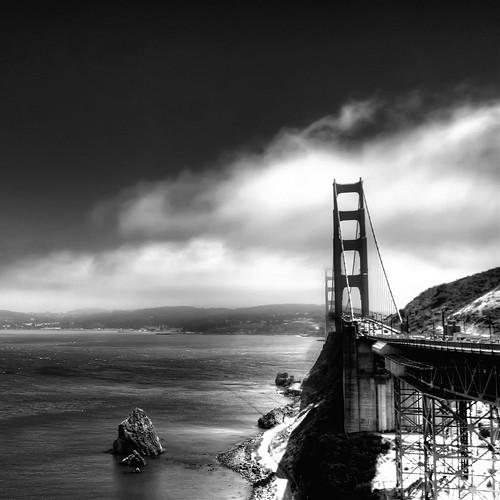

I was talking to my mom on the phone the other night, and she reminded me that it had been nearly a week since I’d written a post on here. Truthfully I almost forgot that I had a blog — I just haven’t had the urge to write much lately. Maybe it’s because my days all sort of blur into each other these days, something hopefully the summer will remedy.

I hung out with an old friend on Sunday, and we basically just bounced around Chilliwack drinking the odd beer in the sun – it was good times. I even managed to whack a few balls up at the Cultus Lake driving range. Most of them ended up about four feet in front of me, but the odd one made it past the 100 whatever marker.

About two hours before bed last night I had the urge to drink a coffee. I told myself it wouldn’t keep me up, but boy was I wrong. I tossed and turned until about 2:30am, and eventually woke up around 7am when the sun started shining on my face in my bedroom. Needless to say, I’m pretty beat today. Sometime tonight I have to head into Vancouver and crash at John and Rebecca’s house. Tomorrow the three of us are driving down to Seattle, and then boarding a plane to San Francisco.

I haven’t been to San Francisco since about a year ago, so I’m definitely looking forward to it. It’s going to be a fairly quick trip, and I should be back in my own bed on Monday night. The weekend after that I plan to just relax and take it easy, maybe even venture up to the lake with a tent and get a bit of camping in. Dale and I are still fairly busy with BraveNewCode, but are slowly ramping down a bit for the summer. While we’ll still be around doing work, I think we’re both going to take a bit of down time in July and recharge the batteries a bit. I’d love to do a road trip, maybe down the Oregon coast, or maybe up to Banff again for a few days.

Anyways, I’ll probably post a few photos from WordCamp San Francisco over the weekend. Other than that I’ll be back to my regularly scheduled nothingness in a few days.