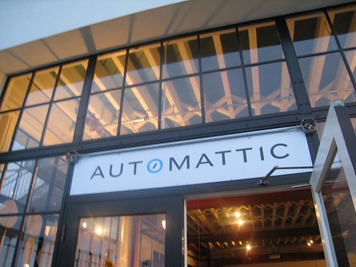
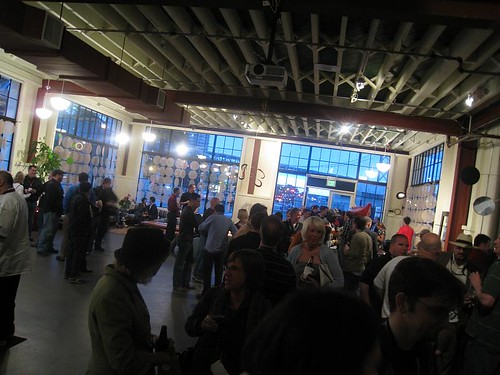

Yesterday was WordCamp San Francisco, and Rebecca, John Bollwitt, John BIehler, Dale and myself all attended. The night before we thought it was a good idea to sit around and drink margaritas until around 2am, so we were all a bit tired during the event. But it was a great event, and we’re all glad we made the trip down.

Several fairly exciting things happened during Matt Mullenweg’s **State of the Word Presentation**. First, Matt showed a slide which displayed some of the new profile information that is going to be coming to WordPress.org — BraveNewCode has actually been helping with that effort, so it was great to finally have some of it shown to everyone. Second, Matt displayed a list of the coolest three WordPress plugins, as voted by people on his Twitter stream. The first plugin that was shown, the third coolest plugin, was actually [WordTwit](http://www.bravenewcode.com/wordtwit). Dale and I were both pretty floored seeing it up there in all it’s glory on Matt’s slide in front of about 700 people. The second coolest plugin was a related posts plugin. And then, Matt flipped to the number one coolest WordPress plugin, none other than Dale and my [WPtouch](http://www.bravenewcode.com/wptouch) iPhone plugin. So, [BraveNewCode](http://www.bravenewcode.com) walked away with the #3 and the #1 spots for the coolest WordPress plugins — a pretty exciting event for us to be sure. So thanks to everyone who voted for us.

Later that night we attended the social down at Automattic’s new offices at Pier 38. I had the chance to meet a lot of great people in person, many of which I had only talked to online before. The bar was completely open, so most people did fairly well in the liquor department. Afterwards all of us found a little hole-in-the-wall diner and had a nice greasy meal to close out the evening. I’ve been really enjoying guacomole lately, and I managed to find a hamburger that had a healthy dose of the stuff on it.

Tomorrow I’m going to be making the long journey back home. I’ll save the details of that for my next post.