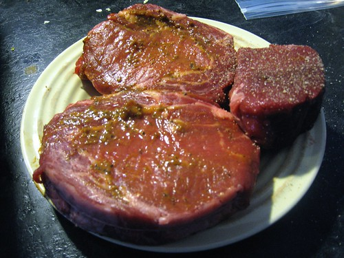

I bought a new BBQ a few weeks ago, and have pretty much used it everyday since. My favourite food to cook on the BBQ are peppers roasted in a bit of olive oil. Second favourite thing would be a good steak. I don’t eat a lot of potatoes, but I’m thinking about doing up some nice little potatoes in some type of dill sauce or something.

Anyways, I’m looking for awesome new BBQ recipes. So, please drop a comment with your favourite thing to cook on the BBQ, and possible include some information on how to make it! Thanks.