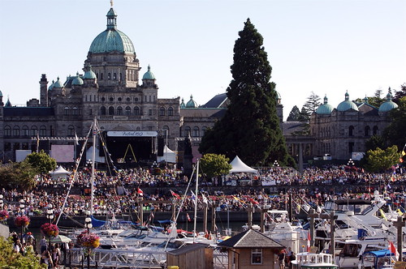

About a month ago I got an email from [Coast Hotels](http://www.coasthotels.com/) asking if I’d like to partake in an all-inclusive weekend in Victoria with a few other bloggers and social media people from Vancouver. Given how much fun I had in Victoria last summer with Arieanna and Ianiv for the BC Festival 150 concert, I jumped at the opportunity, especially since Coast Hotels was supplying the accommodation and transportation.

The trip will start off on Friday morning at the Coast Hotel in Vancouver — everyone is meeting and boarding a bus for the Tsawwassen Ferry terminal. From there, we’ll all travel to the Tsawwassen Quay for a coffee and to browse through the market, eventually boarding the 11am Coastal Celebration ferry to Victoria.

The itinerary for the rest of the weekend is as follows:

#### Friday

- 11:00am: Board Coastal Celebration ferry. Buffet lunch will be included.
- 12:45pm arrival time: Ferry docks at Swartz Bay (Victoria). Welcome to Victoria!
- 1:30pm: Sea Cider Farm &amp; Cider House for cider tasting and tour compliments of Sea Cider Farm &amp; Cider House
- 4:00pm: Check-in at Coast Victoria Harbourside Hotel &amp; Marina
- 5:00pm – 7:00pm: The 15th annual BC Wine and Oyster Fest

#### Saturday

- 8:30am: Meet for group breakfast at Blue Crab Bar &amp; Grill in hotel
- 9:30am: Royal BC Museum
- 11:30 am: Victoria Harbour Ferry tour and trip to Brew Pub
- 12:00pm: Lunch at Spinnakers Gastro Brewpub compliments of Spinnakers and Tourism  
    Victoria.
- 1:30pm – Evening, exploring Victoria

#### Sunday

- 9:15am: Meet in hotel lobby. Departure at 9:30 to Swartz Bay ferry terminal for 11:00am  
    sailing.
- 1:30pm: Drop off at Coast Plaza Hotel &amp; Suites to end the tour!

So, I’ll probably be back home in Chilliwack around 3pm or so on Sunday.

Without a doubt, I’m totally excited about this trip, and am very thankful [Coast Hotels](http://www.coasthotels.com/) and [Tourism Victoria](http://www.tourismvictoria.com/) extended the offer to me. I’ll be bringing my camera gear and will do my best to return the favour by taking some photos of the hotel and as much of Victoria as I can fit on an 8GB compact flash card.

I’ll be heading into the city tomorrow night and will probably be spending the night at Arieanna and Ianiv’s house (since I haven’t seen them in a while, and they’re also coming on the trip). Friday morning we’ll head down to the hotel, and start our weekend adventure — a big thanks to Danny Dang, Coast Hotels, BC Ferries and Tourism Victoria for making this happen!