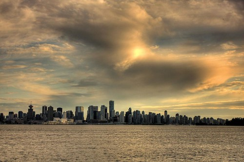
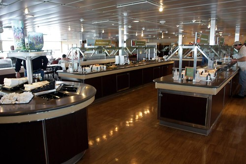
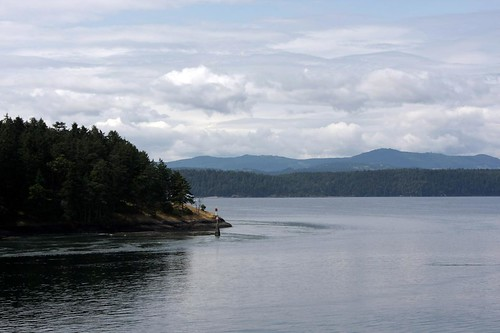
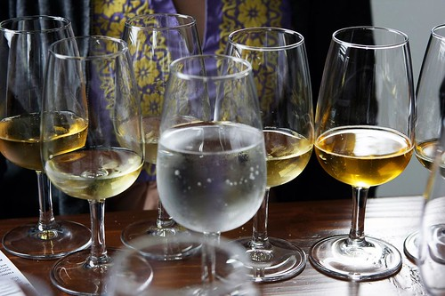

I had the opportunity to spend last weekend in Victoria with some of Vancouver’s best food and travel bloggers, courtesy of Coast Hotels, BC Ferries, and Tourism Vancouver. The trip started as nothing more than a quick email from Danny Dang, social media coordinator for Coast Hotels, in which he invited me to participate in an all inclusive weekend on the island. Given that I really enjoyed myself last year in Victoria, I thought it would be a great opportunity to spend some time on the Island and visit some of the local attractions.

I left my apartment Thursday evening and ended up at [Arieanna and Ianiv’s](http://blogaholics.ca) house for the evening. We went for a quick trip down to the Quay so that I could take a few photos. I ended up snapping an HDR of the sun setting over downtown Vancouver:

We woke up bright and early and made our way down to the Coast Hotel near Denman street where a bus was waiting for us. We met everyone who was coming with us on the trip, and proceeded to the Tsawwassen ferry terminal. We were treated to the [Pacific Buffet](http://www.bcferries.com/travel_planning/amenities/ship/pacificbuffet.html) on the ferry, which is a nice buffet breakfast/lunch in a private area on the ferry.

The food was great, and the area was secluded enough that we managed to relax for a bit and get to know each other before we arrived on Vancouver Island.

Upon arriving on the Island, we boarded another bus that was waiting for us and headed to our first stop, the [Sea Cider Farm and Ciderhouse](http://www.seacider.ca/), a local cider brewery. The only real exposure to cider I’ve had in my life is from Strongbow (which is a funny story, because I ordered it in a Seattle bar thinking it was actually beer). Truth be told, I’m not really much of a cider fan, so I was looking forward to tasting the various incarnations of cider at the brewery.

We were given a nice tour of the facilities, complete with the history of the Sea Cider Farm and the two owners. Afterwards, we met in the tasting room and were treated to approximately nine different tasters of various ciders. Given that I’m from Chilliwack, I set it upon myself to not only taste all the cider, but to actually finish each glass as well, something that [John Bollwitt](http://www.johnbollwitt.com) thankfully participated in. Needless to say, at around the seventh cider or so I was feeling a tad tipsy.

All in all, seeing the cider farm was a great experience, and I highly recommend the trip to anyone in the area. I learned a great deal about cider, and even managed to pick up a few bottles for home on my way out the door.

Stay tuned for the next part in this series, which involves the annual Wine and Oyster event at the Coast Hotel in Victoria.