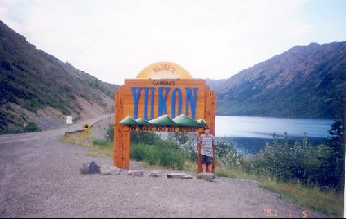

..apparently came and went, and I missed it. I guess that means the days are getting shorter now instead of longer. Strangely enough, while I like summer and am looking forward to a few heat waves, my mind always wonders to the next season. For example, the other day there was a bit of rain, and it reminded me of sitting in front of the fire and watching movies a few months ago. Of course, when autumn rolls around I’ll be thinking of Christmas and of course being trapped in my apartment due to the snow (something that I actually like, probably because some of my best memories from Ottawa involve snow).

Back when I was in Whitehorse, the summer solstice was around the time of the big [Yukon Storytelling Festival](http://www.storytelling.yk.net/), which celebrated oral tradition, and provided a weekend of food, stories, and the occasional drink. It was at that event where I met Cheryl and Marilyn years ago. I was actually renting a room in the burbs from this crazy German lady. She insisted on snooping through my room from time to time, so eventually I decided to leave. Cheryl, who was a single mother with four kids, invited me (despite hardly knowing me) to come stay with her and her family for the rest of the summer, which got me out of a pretty big bind. Over that summer I got to know her kids really well, and spent a lot of evenings playing mario cart with them or helping out with the odd bit of babysitting. Thanks to Facebook, I still keep in touch with Cheryl, Marilyn, and all her kids, most of which have graduated high school now and moved on to bigger and better things. I briefly debated heading up to the Yukon this summer, but I’m pretty sure it wouldn’t have the same mystique it did when I was there years ago, so I probably won’t.

As for me, I’m cleaning up a few big projects, and am then going to take some well-earned down time in July. I’ll still be working on a few things, namely shoring up some of the final changes on some of our plugins and building out both this site and the inthewack.com site, but other than that, expect to see mostly posts about camping or sleeping in the near future.