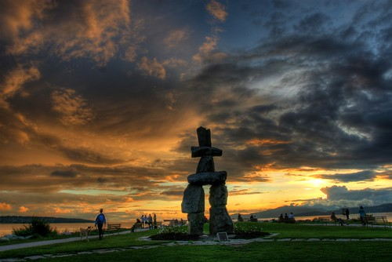

About 18 months ago a few people encouraged me to put some of my photos online for sale. Given that my Vancouver scenery ones are the most popular photos in my portfolio, I’ve pretty much only focused on that. I’ve actually made a decent amount by selling them, probably enough to be able to afford a cheap lens, which is pretty cool.

The next item on my wish list is the Canon EOS 5D Mark II camera, which is one of the most affordable full frame cameras on the market. Unfortunately, the list price of that camera is around $3200, so it’s a bit outside of my price range at this point. So, I’m going to try to come up with a few different ways to try and close the price gap.

The first way I thought I’d raise a few bucks is by offering a sale on some of my Vancouver HDR photos. For a limited time (probably only a week or two), I’ve cut pretty much all the prices on my photos by around 50%. If you’ve been looking for a few scenic shots of Vancouver, now’s your chance to get one for a fairly cheap price. If you want to browse the gallery, [simply click here](http://duanestorey.smugmug.com/gallery/3418360_rtJCf/1/191460517_NaefR#191460517_NaefR).

I’m also going to be selling some of my old camera gear. The 40D will probably go, and I’ll keep the 20D as a backup (I’d rather do the reverse, but there’s still a good market for the 40D, so I’ll probably sell it). I have a quad-core server here too that I rarely use, so I’ll probably sell that as well. Hopefully that’ll bring me half of the way there.