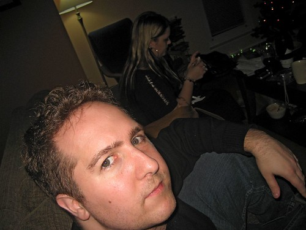

I have an appointment on Wednesday to get a few moles removed from my face. I’ve had them most of my life, and for the most part they haven’t really bothered me. That being said, this last year I’ve found myself cutting two of them while shaving from time to time, which usually results in them bleeding for hours at a time (real attractive, I know).

You can see two of them in this photo. The first is the one on my right cheek, and the second is the one on my left upper-lip. The third one is really tiny, and it’s in the center of my lip (I don’t cut it shaving, but I figure I might as well get it out at the same time).

There are three options with regards to removing moles. Option one is to use a laser to remove the pigment. This works for flat moles, but not really for any moles that are raised (the one on my cheek is raised slightly). Option two is to shave them flat, in which case you basically end up with a large freckle. The disadvantage to that route is that many moles will simply regrow back to the way they were. The third option, and the one I’ve opted for, is to have them surgically removed, in which case they’ll be gone forever.

The surgery is fairly simple, and is done under local anesthetic. On July 8th I have an appointment at 5pm in Vancouver to have the procedure done. It’ll take roughly 45 minutes, and I’ll walk away with about 3 stitches in each area. After that, the moles are sent to a lab to make sure they’re not cancerous (just a formality, as mine display all the characteristics of being benign). I’ll have stitches in my face for about five days, after which they’ll come out and I’ll have to stay out of the sun for a few weeks (or put on some of the SPF 60 sunscreen I recently purchased for the event).

I probably could have made the argument with my GP that they should be removed free of charge, but in that scenario usually the GP will do the surgery, which ends up being a hack job. So in my case, given that I’ve already had experience with a plastic surgeon (the one that put my eye back in the right place and fixed my eye-socket), I simply opted to pay for the procedure myself out of pocket, mainly for piece of mind, and to know that a board certified surgeon would be doing the operation (one that has a vested interest in doing a good job, since we’ve dealt with each other before).

Having been through a few surgeries on my face in the past, I can’t say I’m particularly looking forward to it. That being said, it’ll kind of be nice not to have any moles on my face anymore, especially when it comes time to shave.