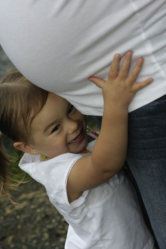

Tonight some of my old friends came for a visit, and we went down to the little park near where we grew up to take a few family photos. Unfortunately the weather wasn’t really cooperating, and we got rained on a little bit.

One of the biggest challenges for taking family photos is working with children. Children are obviously full of energy, and taking photos isn’t always something they like to do, especially when there are swing sets and ducks waddling around. Thankfully Kaede was happy to accommodate a few photos in between duck feeding sessions.

Since Kaede is about to be a big sister, we also took a few fun shots of Kaede and the baby.

This is the first time I’ve done family photos in a very long time, probably close six months, so it was refreshing to get outside again and shake some of the dust of my lens.