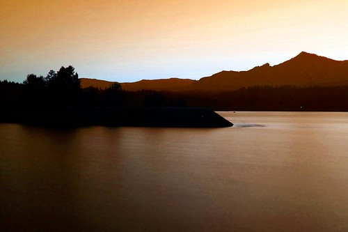

I’m current hanging out at the KOA in Cascade Locks, Oregon. It’s fairly dead here tonight, mainly because most people left today to go back to their 9-5 routines. Thankfully the wireless works a lot better now that not everyone is using it.

My friend Sean swung by tonight, so we had a few beers around the picnic table. It was good to catch up. Last time I saw him was probably about six or seven months ago down in Portland when I had a job interview.

I briefly went into Portland this afternoon to do a bit of work and to unlock my iPhone 3GS. Once I had my phone unlocked, I went down to Best Buy and picked up an AT&amp;T pay as you go phone. I tried to activate it in the store, but the system of course had problems and said to call them for activation. When I got back to my campground, I gave them a call, and spent about 30 minutes on the phone trying to activate it. Unfortunately we got disconnected at that point, and I just didn’t care enough to call back. Maybe tomorrow.

I went out to take a few photos tonight, and got myself into a prime location with a tripod. Unfortunately, once I pressed the shutter button, I was greeted with the ominous “NO CF” warning, which means I had forgotten to bring a memory card. I went back and got one, but unfortunately the lighting at that time wasn’t as good. Even so though, I got a decent shot of the sun setting near here:

I’m not sure what I’ll do tomorrow. I’d like to do some client work, which means I need to be near WiFi. Unfortunately, the only campgrounds with WiFi tend to be KOAs, and they’re not as nice or as rustic as some of the State Parks. So I’m going to go down to Best Buy or Future Shop or something and see if I can get my AT&amp;T card activated, or maybe even see if I can get a mobile stick or something that will let me use my laptop on 3G down here.

If I feel up to it, I might do the 2.5 hour drive tomorrow down to Cannon beach and setup shop there for a few days. And if not, I’ll probably find somewhere else near here.