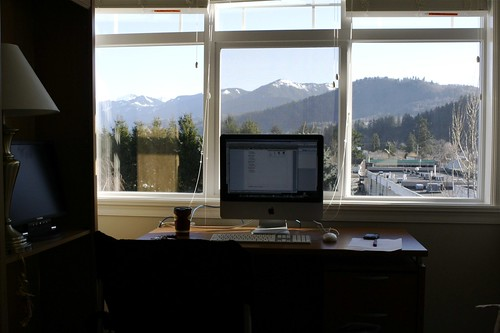
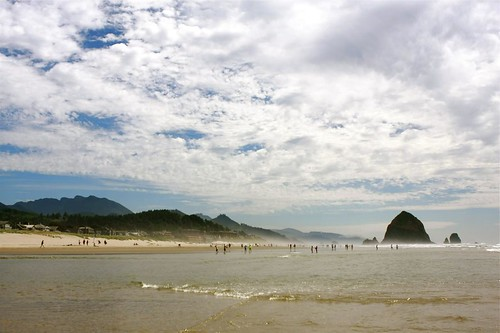

I woke up yesterday in Cascade Locks, Oregon and decided to hit the coast for a few hours. I bounced through Portland, grabbed a coffee and some breakfast, and had a really great, leisurely drive along a forested road towards Cannon Beach. I pulled in right around lunch time, and hunted around for a good place to grab some food. Thankfully I found a neat little brew pub, just a block from the water.

I tasted a few of their beers, and also a nice plate of Halibut and Chips. Afterwards, I grabbed my camera and spent about an hour down on the beach.

Cannon Beach is of course super beautiful. The big monolith in the water, Haystack Rock, is one of the largest in the world, and photos really don’t do it justice. In addition, Cannon Beach was used in a few scenes in “The Goonies”, so it’s a good spot to see if you’re a fan of the film.

After leaving the beach, I was originally going to find a nice campground. Unfortunately, after driving down the coast looking for a place to camp, most places were either full or absolutely horrible looking. After spending several hours looking for a spot, I had to make a decision to either keep on searching, or to come up with a plan B. I really didn’t want to end up at the bottom of Oregon and have a 12 hour drive ahead of me, so I decided to start backtracking.

I ended up close to Seattle, and was debating stopping somewhere there for the evening. Given how I didn’t really have a great sleep the night before, I just decided to head on home and regroup up here. So I rolled back into Chilliwack around midnight last night, and hit the sack. My sister and brother-in-law actually cleaned my apartment while I was gone, and even got me a few groceries (much appreciated guys), so it was nice to come back to that.

The good news is that I have a few client projects that still need a bit of work, and now that I’m back in Chilliwack, can try and finish them off (it was actually weighing on my mind a bit while down south). I also realized while down in Oregon that most of the campgrounds there don’t even come close to how nice Cultus Lake is. With that in mind, I reserved a campsite for most of next week up at the lake, and will reconvene my little vacation then.

All in all, a great couple days down in Oregon, and I’m totally glad I went. I’m definitely looking forward to kicking my feet up at the lake next week as well.