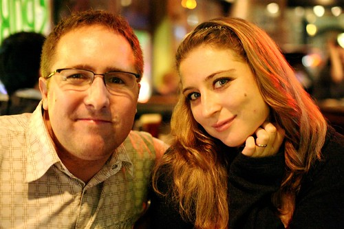

Last week I had the chance to talk to Paul Henderson of the Chilliwack Times regarding Blogathon. We ended up talking about various other items, including Facebook and Twitter, and some of my thoughts about the stuff I was doing over at InTheWack.com (which I need to update a bit more frequently).

Today the Chilliwack Times ran a story in the local paper, and it appears [the online version is available here](http://bit.ly/1H0kQ).

Just a couple of clarification points:

- Last year Rebecca and I supported the Union Gospel Mission. This year she is supporting it (as well as others I’m sure). The caption in the photo seems to indicate all proceeds of Blogathon will be going to the Union Gospel Mission. That’s only the case for Bloggers that are supporting the UGM
- This year I’ll be supporting the BC Children’s Hospital, and I’m looking forward to helping the kids

Blogathon starts this weekend at 6am, and will continue for the following 24 hours. Right now I’m feeling a bit tired, so I definitely need to get some more sleep before the event, and stock up on caffeine. Thanks to the Chilliwack Times for bringing some exposure to the event. If you saw the article in the paper, then drop a comment and say hi.

If you’d like to sponsor my efforts, please [visit this site](http://www.blogathon.org/pledge.php?blogid=156) and leave a pledge. Thanks!