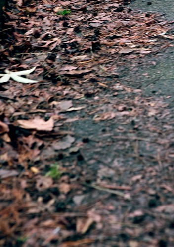

This is it folks, summer. Like most summers, I do my best to relax a bit and venture into the outdoors as much as I can. Most summers I’m not entirely successful, but last year I actually managed to go camping three or four times, which was enough to satisfy my cravings for the season.

Camping is actually one of the few things I really enjoy in life: just tossing my tent into the back of my car and driving off into the distance. Maybe it’s that feeling I get when I’m half-cut and I stare up at the stars for a while, or the enjoyment I get watching the lights from the campfire dance around the trees all night. Maybe it’s the calm I feel while falling asleep with the sound of some little brook trickling nearby, or the crisp cold air that rushes into the tent in the middle of the night and makes me pull the zipper up a little higher. Whatever it is, it’s something that’s dear to my heart, and something I always hope I find the time to partake in. This passage from Wordsworth’s “Tintern Abbey” always reminds me of camping, and how I feel about it.

> These beauteous forms, through a long absence, have not been to me as is a landscape to a blind man’s eye: but oft, in lonely rooms, and ‘mid the din of towns and cities, I have owed to them in hours of weariness, sensations sweet, felt in the blood, and felt along the heart;

This passage is also pretty relevant:

> While here I stand, not only with the sense of present pleasure, but with pleasing thoughts that in this moment there is life and food for future years.

Like the summers prior though, this one too will eventually give way to autumn. No real complaints here though — while I love camping, being hot and sticky for more than a few weeks at a time tends to grow old rather quick. I’ve always been a big fan of the fall — I tend to go outside a bit more, to take a few more photos, to take a few more walks, and to see a few more sunsets. In Ottawa I would go for long walks, often kicking leaves out of my way as I strolled through the park near my house. I would walk with the knowledge that in a few months the city would be blanketed in snow, that the greens and oranges would be replaced with dreary grays, and that all the life and activity in the city would disappear, slowly to reemerge in six months. My walks in the park would be replaced with movies on the couch, more often than not, just an excuse to sit in the corner of my couch and watch the snowflakes silently fall by the streetlights outside.

Lately I’ve been thinking about my past more. It’s possible walking around the streets where I grew up has something to do with it, but I’ve been trying to reconnect some of the pieces in my head. I was visiting an old friend of mine a few weeks ago, and while driving to his place, I remembered a time, years ago, when I had lived close to him, when I had driven down that street countless times. And yet, I hadn’t even thought about that period in my life in ages. Just driving down that road brought back a flood of memories, memories from a different time, from a different me.

Funny how times change, how we change. How the seasons come full circle, and so do some of us people.