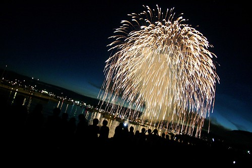

I doubt that this year I’ll be able to watch any of the fireworks, but in previous years I’ve tried to catch at least one fireworks display. Strangely enough, you’d think I would have seen them all, given how I lived right on the corner of Beach and Howe in Vancouver for three years.

I have lots of memories of the fireworks, but my favourite memory, and a story I tell often, involves some heartache and a beer. I had just broken up with my ex-girlfriend, and was feeling a bit blue. So my friend Dustin came to hang out, and we decided to see the fireworks. Since we had a few hours to kill, we grabbed the little Granville Island ferry and went on down to the Cat’s Meow for a few beers.

It was such a good time in fact that we were both a bit startled and surprised when we saw flashes of light and heard the distant sound of “booms” from our little patio table. Apparently we had managed to drink our way right through the starting of the fireworks. So we figured, might as well just keep going.