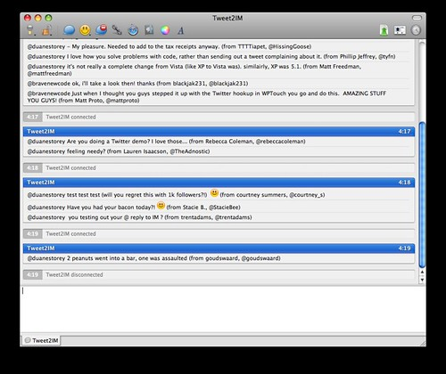

One of the things I’ve noticed lately is that I’m spending way more time on Twitter than I’d like. Truthfully, it’s fairly addictive, and I really don’t know why. This afternoon I noticed I noticed myself sitting on the updates page, refreshing occasionally, waiting for a few replies to some messages I had sent out. While doing that, I had the sudden idea that Twitter (at least for me) would be a bit more useful if it were a push system instead of a polling system. That way at least, I wouldn’t have to sit at the site and continue to poll it — I could simply be notified when a new @ message was ready for me.

Granted, there are numerous applications that can be used, but all of them (that I’ve used at least) are limited in that they primarily only handle one account at a time. So I decided to try hacking out a quick little PHP script that would simply IM me whenever I had a new message waiting.

It actually only took me about 20 minutes to finish, partially because I leveraged [the XMPP PHP](http://code.google.com/p/xmpphp/) library, and partially because I’m familiar with the Twitter API (thanks to my work on WordTwit). I wrote it such that it would do the following:

- Check Twitter updates from multiple accounts
- Keep track of the last received IM message such that it only asks Twitter for new messages
- Send out IMs periodically of new messages

I set it up on a five minute CRON job on my server (which is also whitelisted for the Twitter API). The end result is visible here:

As you can see, I get updates periodically with information, along with a prefix letting me know which account it came from. So far, it’s been working out well, but I’m having a bit of a hard time retraining myself not to check Twitter’s web interface from time to time. I’ve been told Adium has some Twitter features in a beta version, so I might check that out as well.

I’ve disabled growl notifications in Adium for new updates on this account (mainly because I don’t want to be distracted), but it’s nice to simply look down at the Dock from time to time to see how many replies I have waiting for me. So at least for now, this is a nice change, and hopefully will increase my productivity a bit.