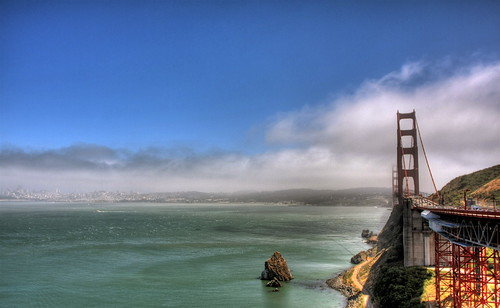

Another great city that I’m fortunate enough to spend a lot of time visiting is San Francisco, California. I was recently down there in June for a big WordPress conference, and will probably be down there again in a few months I imagine. Here’s a shot I took of San Francisco about a year ago from just north of the Golden Gate Bridge.

I also just picked up a few diet cokes. Which means that today so far I’ve had three coffees, and one 500ml diet coke. Here’s a shot of the current carnage:

