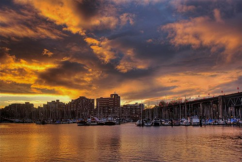

Without a doubt, one of my favorite events to shoot is a sunset. I used to live a stone’s throw away from the Pacific Ocean, and walking down and watching the sun set was pretty much a weekly or a semi-weekly event during the summers. I know that many photographers think that sunset photos are a bit cliche, but I’ve never thought so. To me, watching the sun set highlights some of the real beauty of this world, and reminds me of all the great things that bring me joy in it.

So, here are a few of my favorite sunset photos that I’ve taken over the years:

