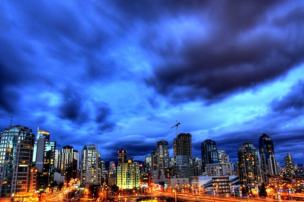

I was one of the first people in Vancouver to experiment with HDR (high dynamic range) photography a few years ago. I definitely wasn’t \*the\* first, because I actually got a bit of inspiration from a few other photographers in Vancouver who had been dabbling with HDR.

For yucks, I thought I would include the very first HDR shot I ever put together. It’s a shot of Vancouver on a really storm day. I shot it from my balcony using a tripod, and merged three photos together using a tool on the Mac called Photomatix. Here’s the end result:

