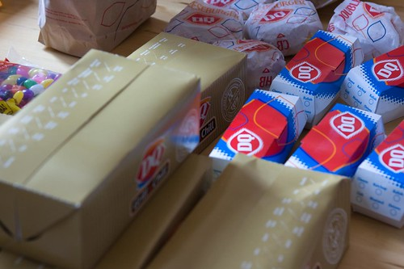

We just had a pile of Dairy Queen here, which was awesome and much appreciated. So thanks Dairy Queen, for the food, and thanks Rebecca, for organizing it’s delivery.

Things definitely seem a bit less active around here right now, probably because everyone’s stomachs are all full of food now. I wouldn’t be surprised though if people are losing a bit of stream — we’ve all been at this nearly 8 hours already, and still have 16 hours to go. If my brain were a car engine right now, it would probably be firing on only one cylinder. I’ve been having a hard time constructing complete sentences in blog entries, and I’m relying on the built-in spell checker for pretty much everything right now.

Thanks to an anonymous $150 donation, I’ve hit my original goal of $1,000. Thank you to whoever donating that amount. Because it’s still early, I’ve raised my goal up to $1,200 in an effort to raise a bit more money for the BC Children’s Hospital Foundation. If you would like to donate, you can do so [by clicking here](http://www.canadahelps.org/GivingPages/GivingPage.aspx?gpID=4875). Thanks.