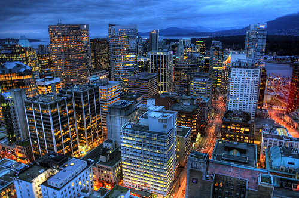

Vancouver is without a doubt one of the prettiest cities in the world, something that I appreciate more and more every time I go on a trip. In fact, I was just mentioning to a friend yesterday just how clean and inviting Vancouver is compared to most cities, specifically San Francisco and Los Angeles (both of which seem grubby and dirty by comparison, even though I happen to like aspects of both).

And while Vancouver is a pretty city, it is not without its problems. In fact, Vancouver’s lower-east side is one of the poorest neighbourhoods in all of Canada, which is ironic given that it’s about 5 minutes away from one of Vancouver’s richest. There is also a great deal of controversy in the city with how the homeless are being treated with the upcoming 2010 Olympics looming in the distance.

After living in Vancouver for the better part of ten years though, I decided to leave the big city for a while and head back to the country. I moved about 100 kms east of Vancouver, to a little farming community called Chilliwack. It is the small little town where I grew up, and it’s been really welcome change for me.