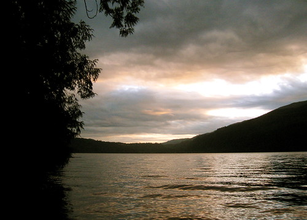
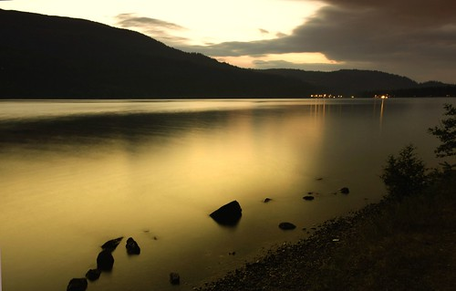

Since I wrote in detail about Vancouver in my last post, it’s only fitting that I talk a little bit about my current place of residence, Chilliwack. Chilliwack is a little farming community nestled between a mountain range, approximately 100 kms east of Vancouver. My apartment is probably only about 5 minutes from one of the nicest provincial parks in the province, complete with it’s own picturesque lake:

I currently rent a 1200 square foot apartment for about $100 less a month than I was paying in Vancouver for my 700 square foot apartment. A new grocery store opened about two blocks away from me, so I can literally walk to the grocery store and back in about 15 or 20 minutes. I’m also about a six minute walk from one of the nicest gyms in the city as well, so I’ve been slowly trying to work myself back into shape, a welcome change after being perpetually tired and run-down for the last five years or so.

I spent the last ten years working hard in the high technology sector, so being back in a little farming town, a town where most stores shut down around 9pm, has been a welcome change, albeit a strange on at times. It’s made me realize just how important my family is to me, and how ridiculous some aspects of a fast-paced life really are. I’m thankful that I’ve come to some of these realizations now, while I’m still relatively young, as I believe my life is going to be that much better because of them.