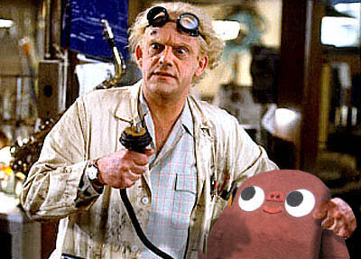
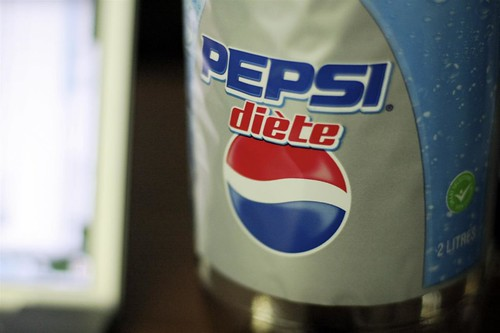

As we all know, the flux capacitor is what makes time travel possible. Blogathon, on the other hand, is made possibly by everyone’s favorite stimulant, caffeine. And so this post is dedicated to caffeine in various forms.

I’m currently on my third coffee. I woke up and had a 7-11 coffee (because that’s all I could find at 5:30am), then pounded back some coffee here at Workspace, and just picked up a new coffee from a little Gastown coffee shop called Lunas. I imagine I’ll probably average a coffee every two hours or so, which would put me somewhere in the neighborhood of about 600 – 1200 mg of caffeine over the course of the day, which is a fairly large amount.

My other favorite form of caffeine is diet pepsi. Given that I don’t really react too well to normal sugar, and that I also enjoy pop, diet pepsi is a pretty logical choice. Back in the old days, when I was at my first startup, I used to show up at work with a 2L of diet pepsi every day and slowly work my way through it over the next 12 hours or so. Definitely not the healthiest diet in the world, but it worked wonders for writing code.

So, as the day progresses, I’ll probably also update everyone on my caffeine status, as I’m sure it’ll be rather large. Thanks everyone for the donations so far — I’m up to about $665 $685, and hoping to hit $1,000 before the event is over.