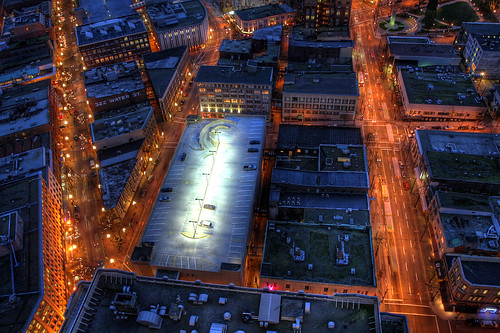

A bunch of us are currently down at Workspace in Vancouver, which is a shared office space situated right on the water in Gastown. I have a rather great view of the North Shore mountains along with the cruise ship terminal at Canada Place.

One of my favorite photos is this next one from Gastown I took last year from the lookout at Harbour Center:

I actually shot the photograph through a window, so it’s surprising that you can’t see any glass. But I’ve always liked all the angled lines in the photo, and of course the film-noir type lighting. If you’re ever in Vancouver, make sure you head on up to the view point and check out the view.