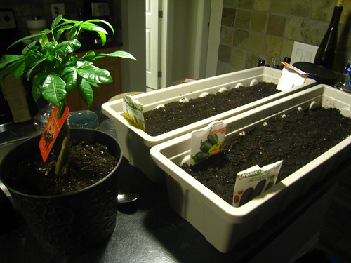

I moved into a new apartment in January, and for the first time in ages, had a decent sized patio. Since my patio faces south (and subsequently, receives a lot of afternoon soon), I figured I would try growing a few different vegetables. When I started, I had just a few planters, and it looked something like this:

When things started sprouting, I got excited and decided to plant a few more things. Here’s a shot a few weeks after I started:

I haven’t taken any photos of it in a while, but here’s a shot I took a few weeks ago.

Since that time, a lot of tomatoes have formed on my tomato plants, and my peppers are about half way grown. I’m pretty excited for the tomatoes to be done, at which point I can make some home made pico de gallo.