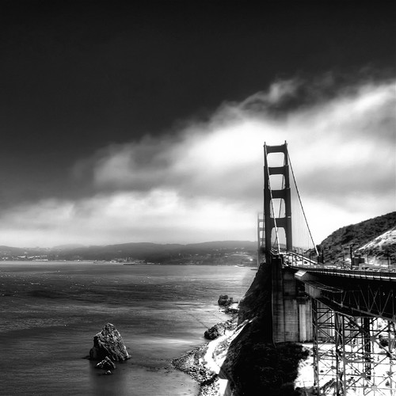

My camera is a digital SLR, and by default captures color instead of black and white images. That being said, once and a while I do take the odd photo that I think would work well as a black and white photograph.

I actually converted this photo into a black and white, but didn’t really think that much of it. After uploading it to Flickr though, it became one of my most popular photos — currently 43 people have indicated it’s one of their favorites. Based on the response, I ended up printing out a copy for myself and put it on my wall at home.

It should also be noted that the image has a square aspect ratio (the width is the same as the height) — another unusual framing style for me.