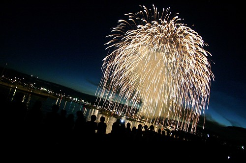

This is one of my favourite shots. I took it down at the Celebration of Light two years ago. It was my first real time shooting fireworks with my camera. Unfortunately, I didn’t have a tripod, so I basically experimented all night with settings that would allow me to handhold a fireworks shot. I ended up with a few keepers, but a lot of the ones I shot ended up being a bit blurry (which is why a tripod is usually preferable).

There are fireworks here in Vancouver tonight, but right now it’s a bit rainy. So we’ll see how things look around 10:05pm when the first few go off.