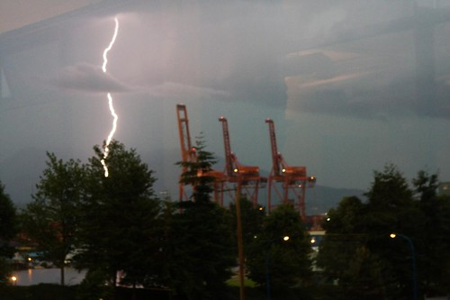

Seems like the Blogathon gods are mad, and are punishing those people on Vancouver’s north shore who weren’t blogging today. From my vantage point, it’s pretty gloomy over there. We’ve been watching lightening strikes for a while hit the mountains over there. While John Biehler thinks he’s safe, I’m pretty sure he’s in for a world of hurt over there, but we’ll see.

My mom called a while ago and said that it was pretty stormy out in Chilliwack. Given that I didn’t water my plants before I left, I’m actually kind of thankful to hear that. Hopefully when I get back tomorrow they’re all still alive and still producing fruit.