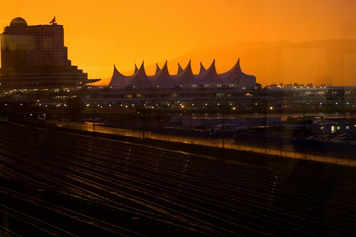

I actually remember last year about this time, when I hit the 40 mark. It’s a good feeling, mainly because everyone can see the light at the end of the tunnel. But we still have a bit more time here, so I’ll keep pumping out blog entries! Donations are still open, so if you’re still up and feel like contributing to the BC Children’s Hospital, then please do so — your donation will be appreciated, and will go directly to helping out the children there.

There was a pretty wild sunset in Vancouver tonight, and I managed to grab a photo of it. So I’ll end this blog entry with a photo of the sun setting over Vancouver harbor tonight:

