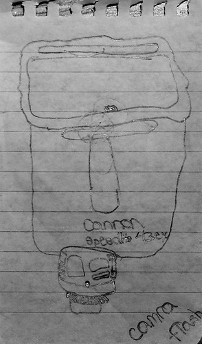

I went to bed last night at around 11pm, and slowly drifted off to sleep. For the most part, I had a decent sleep, and managed to get myself out of bed at around 7am. So I think I’m basically recovered from Blogathon at this point.

I was just up at Cultus lake sorting out my registration. There was a line up of cars about 20 deep waiting for the registration office to open, so it took me about an hour to get to the front. Of course, there were a few people who showed up and cut right to the front of the line, thinking for some reason that a re-registration or some issue from the night before was enough reason to bypass all of us who had been waiting all morning. I almost got out of my car to say something, but decided to keep my pie-hole shut. Of course, my phone didn’t seem to work up there either, and I wasn’t able to do my 8am interview with the local radio station here (way to go Rogers!).

So while I’m now officially registered for camping, I won’t be able to actually set up until around 1pm or so, which is ok because I have a pile of work I want to get done today too. I’ll come home during the days to do work, have a shower, and water my plants, but plan to spend my evenings up at the lake. If I get 3G up there, I might even just work from the picnic table tomorrow, but we’ll see.

The photo up above is a sketch that Derek Miller’s daughter made of my Canon speedlight at Blogathon the other day. It’s a [good drawing, so I thought I’d include](http://www.flickr.com/photos/penmachine/3760577453/) it here.