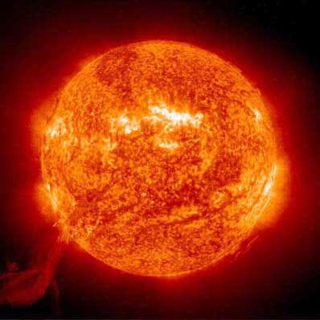

I gotta say, this week has been fairly insane in terms of heat. Given that I live inland now, it’s been a few degrees warming than in Vancouver. The other day, while camping, the humidex hit 45C up at the lake, which is actually hotter than the hottest day I experienced back in Ottawa when I lived there (which was 43C). Let me tell you, it’s hot.

I just tossed some burgers on the BBQ here. I briefly debated just tossing them on the ground, as I’m pretty sure they would have cooked just as well down there. I just finished watering my tomato plants for the second time today, as they were starting to look a bit hot and droopy. I imagine I’ll have to water them again in a little while.

Right now, I’m super thankful my apartment has central air here. Given that it’s powered by a heat pump, and that the temperature outside is so warm, it’s definitely struggling a bit to keep this place cool. But at least it’s working for the most part. I’m actually thinking about packing up my campsite tonight and simply heading back home to be in the A/C.

Anyways, everyone drink lots of water, and try to stay out of the sun. I imagine the UV index is rather insane right now.

How is everyone fairing right now? Pretty hot and sweaty?