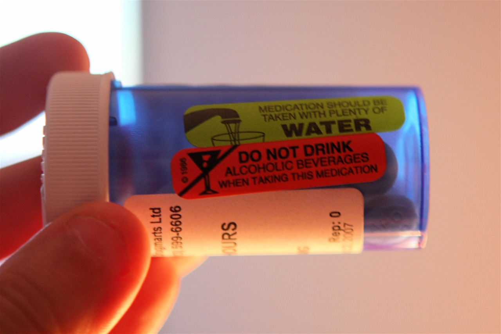

Almost two years ago, I was at work one day, banging on the keys and writing some code. Suddenly, I felt cold, and realized that my hands and my fingers were shaking. I tried to stay at work as long as I could, but after a while my hands were shaking so bad I could hardly function at my job, so I went home.

I curled into bed, and wrapped my duvet as tightly as it would go around myself. No matter how hard I tried, I just couldn’t stop shivering. I ended up eventually falling asleep, and slept most of the night away. When I woke up, I was drenched in sweat, feeling like absolute garbage.

Six days later I wound up in the emergency room at St. Paul’s hospital, hooked up to an oxygen mask with my finger in a pulse-oxymeter. An hour before, I was at home, fighting to catch my breath, and struggling to reduce a 104F temperature. When I realized it was a losing battle, I called cab and headed for the hospital.

The official report said that I was not only extremely [hypovolemic](http://en.wikipedia.org/wiki/Hypovolemia), but that my left lung had partially collapsed due to infection. I spent a few days in the hospital, and received a pile of antibiotics as well as blood plasma. Whatever the root cause was, I’ll never really know, but I was as sick as I’ve ever been in my life.

I spent another week recovering at home, trying to get my lungs working properly again, and also trying to adjust to eating solid food. Unfortunately though, I still felt rather sick, so I ended up getting a few more tests down. What they came back, it turned out that I had contracted a super-bug in the hospital known as clostridum difficile, or c. diff. for short.

Clostridium Difficile (commonly called C. Diff.) actually used to primarily only affect older people, but lately it’s started to affect (and kill) young individuals as well. It is fairly lethal, and is one of the main causes of death amongst the elderly in hospitals. Normally the good bacteria in the intestines (known as the intestinal flora) can combat c. diff fairly easily. Unfortunately though, the use of broad spectrum antibiotics in hospitals often destroys most of the beneficial flora in the intestines, making an individual susceptible to acquiring c. diff. in a hospital setting, which is what happened in my case.

Fighting Clostridium Difficile with Flagyl

There are really only two drugs that work against Clostridium Difficile – Flagyl, which is a rather cheap drug with a pile of side effects, or oral vancomycin, pretty much the strongest antibiotic available today (so strong in fact that it’s a scheduled drug in the United States, mainly to keep it from being overused and creating even more super bugs). I went through a course of Flagyl, and it basically didn’t work at all. When that failed, I was put on a hefty course of vancomycin (which is also very expensive, even with a health plan – I think I was paying $20 a day, and needed 30 days worth). That treatment failed as well.

It’s actually pretty scary when you’re put on the most powerful antibiotic in the world and you don’t get any better. Given that c. diff. kills people, or often results in the complete removal of the colon, I was a bit worried at that point. My doctor obviously was as well, since he referred me to the center for disease control in Vancouver, where I met a specialist.

I was put on a longer version of Flagyl at that point, and thankfully tested c. diff. negative when it was all over. I’ve had several follow up tests as well since then, and all have come back negative, so it’s safe to say I got rid of it before.

But truthfully, things have never really been the same. There are lots of theories for why it happens, but nobody really knows for sure. Some days I have good days where I feel exactly like I did prior to the infection, but most days I usually have stomach cramps or an upset stomach. On bad days I basically don’t even bother eating, as I know it’ll just end badly for me.

I’ve talked to a few doctors, and most say it’s simply post-infectious IBS, which sometimes spontaneously resolves, but often times doesn’t. I’ve also been told that the antibiotics I received probably obliterated all the catalysts necessary to break down lactose, which basically means I’m lactose intolerant at this point. Which theory is right is anyone’s guess. I haven’t really been able to pin down how I feel with any types of food intake, although it’s something I’m going to work towards. It’s been basically 18 months since I was off of any antibiotics associated with the infection, and truthfully, haven’t really improved that much since then.

Many of the prevailing theories (even about IBS) tend to involve a disruption of the intestinal flora. Given that’s essentially how this whole episode began, I wouldn’t be surprised if the two conditions were ultimately linked, and end up having similar treatments. But for now, I think I’m just gonna keep slugging on, taking the good with the bad, and trying to figure out which food items I’m apparently sensitive to.

### Update – September 2013

This post is one of the most popular I have written on this website, which is both good and bad: bad that so many other people are having to go through what I went through, but also good in that people can find some additional information and extra support via the comments.

I wanted to give an update as well, since it’s been nearly four years since I originally wrote this. I spent around three years or so after writing this post with what I thought was post-infectious IBS. Basically I would have to go to the bathroom quite often, sometimes with little warning. In addition, I ended up with diarrhoea quite often, which wasn’t very much fun.

One product I tried that gave me some relief were prebiotics. Basically prebiotics are a certain type of indigestible fibre that the good bacteria in your colon can ferment and use to multiply. So while probiotics aim to add new bacteria to your colon, prebiotics work by causing the already existing bacteria to multiply. The product I used is called Probiotin, and it seemed to help for me. You can get [Prebiotin on Amazon](http://amzn.to/13mZnUd), or perhaps even locally.

I also made an adjustment to my diet that caused me relief from many of my symptoms – I gave up all artificial sweeteners and most sodas. I did it for health reasons, namely because dumping all those chemicals into my body daily didn’t seem like a good idea. But surprisingly my bowel movements became more regular and the diarrhoea finally started to go away. Three years is a long time to live with both of those symptoms, but I’m happy they are gone now. For the most part I’m back to my old pre-infection self.

If you’ve found this post helpful, please feel free to share it via the widgets below so that others can possibly find it and get some additional support as well. If you’re interested in learning more about c. diff, or have any family you want to educate, here is a great [book on clostridium difficile (c. diff)](http://amzn.to/1dAY1Ij) meant to education patients on their options.