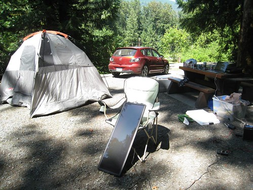

I briefly went into town this morning to water my plants, take a shower, and get a few groceries. I also managed to hook up with the guys and gals down at Hawk FM for a follow-up interview to the blogathon one I did on Friday.

Other than that, I spent most of today sitting shirtless on my picnic table, trying hard not to melt in today’s heat. Thankfully I was in the shade most of the day, but man oh man, when that sun hit it sure was hot.

My sister, brother-in-law, niece and nephew came up for dinner, and just left a few minutes ago. So right now I’m catching up on a few emails, and probably going to do a few hours of work before bed. I’ll probably head back into town again tomorrow for the morning, and then head back up to the lake again for my last night up here. This upcoming weekend is the first one in a long time where I haven’t had any plans, and I’m quite looking forward to spending some time at home.