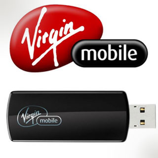

About a year ago, I was down in the United States attending WordCamp San Francisco. While there, my friend Jason lent me a little USB dongle that let me basically surf the web from anywhere. It was a CDMA device that basically piggybacked data onto the wireless towers such that you could use the internet wherever you could get cell access.

I was so impressed by it (remember, this was before the iPhone came to Canada) that I’ve been constantly on the lookout for something like that that I can also use down in the USA, since the Roger’s roaming data rates are fairly absurd. When I looked last year, there were several hardware options I could have gone with, but all of them required either a one or a two year contract at a base monthly price of $60 USD, which was way more than I wanted to commit to.

While down in Oregon last week, I did another pass, and found one of the first pay-as-you go data plans down in the United States: Virgin’s [Broadband2Go](http://web.virginmobileusa.com/broadbandPlans). Granted, the prices for data still are fairly pricey, but given how there’s no contract to lock into, it still seemed like a pretty good option for me. The USD dongle costs $150, after which you can simply buy data a la carte using a credit card or little top-up cards you can buy from Best Buy or Future Shop.

Judging from my current internet usage over 3G, I burn through about 15 MB per hour (at least, that’s what PdaNet on my iPhone says) while I work and occasionally surf the web. So that means the $60, 1GB Broadband2Go option would last me for about 66 hours, or around 15 days if I were to use it for four hours a day or so. Given that one of the primary reasons I want one of these devices is so I can possibly do client work while on the road, or even from various campgrounds in the USA, I can easily recuperate $60 against some client income.

I know some of my friends use AT&amp;T cards and simply opt for a $20 USD/mo data plan that gives them around 100 MB or so of usage, but that’s really not feasible for me if I actually want to get work done on my laptop. In addition, there are various wireless routers (some even battery powered) that take USB dongles, which is an even cooler way to use the device (since a few people can share the same internet connection).

I managed to activate the device in Oregon, and used it for a while there. I even did a Hotwire search from my laptop while stuck in traffic near Salem, Oregon, so it works as expected. I’ll be lending it out to some family to test out next time they’re in the USA, and I also plan to use it a bit more this summer as well.